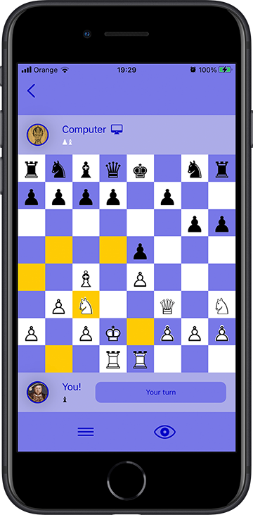

# iOS-Developer-Portfolio

## Composable Chess

This is a chess app built with SwiftUI and ComposableArchitecture [https://github.com/pointfreeco/swift-composable-architecture]. The app is built in a clean and composable way from state, actions and reducers, where reducers are pure functions that give you the next state based on the current state. 

Technologies: ComposableArchitecture, Combine, SwiftUI, GameKit
Platforms: iOS

## iSymmetry
A surface pattern painting app. Brush strokes are transformed into infinite kaleidoscopic designs. Supports all  possible ways to create a  repeating pattern - the 17 “Wallpaper Groups" - and includes infinite scroll.
[https://itunes.apple.com/us/app/isymmetry/id565956977]

Technologies: Objective C, CoreGraphics
Platforms: iOS,iPad

## PaintLab
An iPad painting app for creative experiments. This is a full-featured art app with 69 different brushes, 39 filters with custom UI, multiple layers with blend modes, 3d transforms and innovative colour     selection tools. It’s powered by a high performance Open GL paint engine which creates unique brush effects (e.g. natural charcoal, fluid paint) at 60 fps. Integrates With Apple Pencil and third-party  bluetooth styluses.

Technologies: Swift, Objective C, GLSL,  OpenGl, CoreData
Platforms: iPad

## Koobook
Developed and published  vocabulary game to help kids learn English, with 12 animated word puzzles. 

[https://itunes.apple.com/us/app/koobook-english/id1112574227]

Technologies: Swift, AVFoundation, CoreAnimation

## ARPaint
Augmented Reality 3D painting app

Technologies: Swift, ARKit, Metal, RxSwift

## ARRay
Augmented Reality demo app showing a liquid metal blob rendered inn the environment using ray-marching technique with signed difference functions.
  
Technologies: Swift, ARKit, Metal

